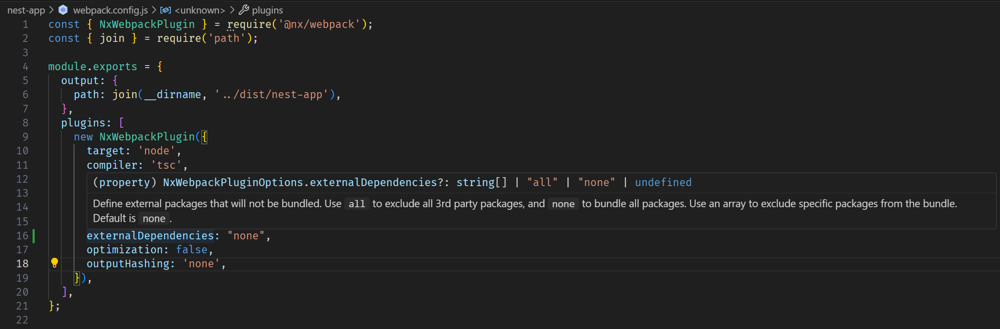

This repository reproduces an issue with building nest apps with `generatePackageJson` in [webpack.config.js](./nest-app/webpack.config.js) from an Nx workspace using `pnpm`.

When running `nx nest-app:build` it produces a dist folder with a `package.json` file, but when running `pmpn i` in that folder breaks the lock file and does not install all necessary dependencies such as `tslib`. According to the nx plugin file [webpack/src/plugins/generate-package-json-plugin.ts](https://github.com/nrwl/nx/blob/fb576670889ab4496d7aa899cb78d81ab4bfcda6/packages/webpack/src/plugins/generate-package-json-plugin.ts) it seems that it should read `importHelpers` from `tsconfig` [which is set to true](./tsconfig.base.json) and include that dependency, but it doesn't.

The lockfile produced for the build is also invalid preventing a clean install of dependencies using `pnpm`:

```bash
pnpm i --frozen-lockfile
Lockfile is up to date, resolution step is skipped
 ERR_PNPM_LOCKFILE_MISSING_DEPENDENCY  Broken lockfile: no entry for '/iterare/1.2.1' in pnpm-lock.yaml

This issue is probably caused by a badly resolved merge conflict.
To fix the lockfile, run 'pnpm install --no-frozen-lockfile'.
```

Setting `externalDependencies: "none"` and running `nx run nest-app:serve` breaks module resolution completely even though the documentation says this is the default value.



```bash
C:\projects\personal\nest-single-bundle [main +0 ~1 -0 !]> pnpm exec nx run nest-app:serve

> nx run nest-app:serve:development

Build option outputFileName not set for nest-app. Using fallback value of dist\nest-app\main.js.

> nx run nest-app:build

> webpack-cli build --node-env=production

chunk (runtime: main) main.js (main) 1.93 MiB (javascript) 793 bytes (runtime) [entry] [rendered]

WARNING in ../node_modules/.pnpm/@nestjs+common@10.3.7_reflect-metadata@0.1.14_rxjs@7.8.1/node_modules/@nestjs/common/utils/load-package.util.js 9:39-59
Critical dependency: the request of a dependency is an expression

WARNING in ../node_modules/.pnpm/@nestjs+core@10.3.7_@nestjs+common@10.3.7_@nestjs+platform-express@10.3.7_reflect-metadata@0.1.14_rxjs@7.8.1/node_modules/@nestjs/core/helpers/load-adapter.js
 9:39-63
Critical dependency: the request of a dependency is an expression

WARNING in ../node_modules/.pnpm/@nestjs+core@10.3.7_@nestjs+common@10.3.7_@nestjs+platform-express@10.3.7_reflect-metadata@0.1.14_rxjs@7.8.1/node_modules/@nestjs/core/helpers/optional-require.js 6:39-59
Critical dependency: the request of a dependency is an expression

WARNING in ../node_modules/.pnpm/express@4.19.2/node_modules/express/lib/view.js 81:13-25
Critical dependency: the request of a dependency is an expression

ERROR in ../node_modules/.pnpm/@nestjs+common@10.3.7_reflect-metadata@0.1.14_rxjs@7.8.1/node_modules/@nestjs/common/pipes/validation.pipe.js 39:92-118
Module not found: Error: Can't resolve 'class-validator' in 'C:\projects\personal\nest-single-bundle\node_modules\.pnpm\@nestjs+common@10.3.7_reflect-metadata@0.1.14_rxjs@7.8.1\node_modules\@nestjs\common\pipes'

ERROR in ../node_modules/.pnpm/@nestjs+common@10.3.7_reflect-metadata@0.1.14_rxjs@7.8.1/node_modules/@nestjs/common/pipes/validation.pipe.js 43:94-122
Module not found: Error: Can't resolve 'class-transformer' in 'C:\projects\personal\nest-single-bundle\node_modules\.pnpm\@nestjs+common@10.3.7_reflect-metadata@0.1.14_rxjs@7.8.1\node_modules\@nestjs\common\pipes'

ERROR in ../node_modules/.pnpm/@nestjs+common@10.3.7_reflect-metadata@0.1.14_rxjs@7.8.1/node_modules/@nestjs/common/serializer/class-serializer.interceptor.js 25:110-138
Module not found: Error: Can't resolve 'class-transformer' in 'C:\projects\personal\nest-single-bundle\node_modules\.pnpm\@nestjs+common@10.3.7_reflect-metadata@0.1.14_rxjs@7.8.1\node_modules\@nestjs\common\serializer'

ERROR in ../node_modules/.pnpm/@nestjs+core@10.3.7_@nestjs+common@10.3.7_@nestjs+platform-express@10.3.7_reflect-metadata@0.1.14_rxjs@7.8.1/node_modules/@nestjs/core/nest-application.js 19:107-150
Module not found: Error: Can't resolve '@nestjs/websockets/socket-module' in 'C:\projects\personal\nest-single-bundle\node_modules\.pnpm\@nestjs+core@10.3.7_@nestjs+common@10.3.7_@nestjs+platform-express@10.3.7_reflect-metadata@0.1.14_rxjs@7.8.1\node_modules\@nestjs\core'

ERROR in ../node_modules/.pnpm/@nestjs+core@10.3.7_@nestjs+common@10.3.7_@nestjs+platform-express@10.3.7_reflect-metadata@0.1.14_rxjs@7.8.1/node_modules/@nestjs/core/nest-application.js 20:124-177
Module not found: Error: Can't resolve '@nestjs/microservices/microservices-module' in 'C:\projects\personal\nest-single-bundle\node_modules\.pnpm\@nestjs+core@10.3.7_@nestjs+common@10.3.7_@nestjs+platform-express@10.3.7_reflect-metadata@0.1.14_rxjs@7.8.1\node_modules\@nestjs\core'

ERROR in ../node_modules/.pnpm/@nestjs+core@10.3.7_@nestjs+common@10.3.7_@nestjs+platform-express@10.3.7_reflect-metadata@0.1.14_rxjs@7.8.1/node_modules/@nestjs/core/nest-application.js 123:120-152
Module not found: Error: Can't resolve '@nestjs/microservices' in 'C:\projects\personal\nest-single-bundle\node_modules\.pnpm\@nestjs+core@10.3.7_@nestjs+common@10.3.7_@nestjs+platform-express@10.3.7_reflect-metadata@0.1.14_rxjs@7.8.1\node_modules\@nestjs\core'

ERROR in ../node_modules/.pnpm/@nestjs+core@10.3.7_@nestjs+common@10.3.7_@nestjs+platform-express@10.3.7_reflect-metadata@0.1.14_rxjs@7.8.1/node_modules/@nestjs/core/nest-factory.js 57:120-152
Module not found: Error: Can't resolve '@nestjs/microservices' in 'C:\projects\personal\nest-single-bundle\node_modules\.pnpm\@nestjs+core@10.3.7_@nestjs+common@10.3.7_@nestjs+platform-express@10.3.7_reflect-metadata@0.1.14_rxjs@7.8.1\node_modules\@nestjs\core'

webpack compiled with 7 errors and 4 warnings (8d686a702f6d8f6d)
Warning: command "webpack-cli build --node-env=production" exited with non-zero status code
——————————————————————————————————————————————————————————————————————————————————————————————————————————————————————————————————————————————————————————————————————————————————————————————

 NX   Ran target build for project nest-app (5s)

   ×  1/1 failed
   √  0/1 succeeded [0 read from cache]

Build failed, waiting for changes to restart...
```

## Steps to reproduce

Prerequisites:

- Node 20
- Pnpm 8
- Windows 11

Create workspace:

```bash
pnpm create create-nx-workspace@latest nest-single-bundle --workspaceType=integrated --nxCloud=skip --preset=apps --defaultBase=main

pnpm exec nx add @nx/nest

pnpm exec nx generate @nx/nest:application --name=nest-app --directory=nest-app --e2eTestRunner=none --projectNameAndRootFormat=as-provided --strict=true --no-interactive
```

Change `webpack.config.js`:

```js
const { NxWebpackPlugin } = require('@nx/webpack');
const { join } = require('path');

module.exports = {
  output: {
    path: join(__dirname, '../dist/nest-app'),
  },
  plugins: [
    new NxWebpackPlugin({
      target: 'node',
      compiler: 'tsc',
      main: './src/main.ts',
      tsConfig: './tsconfig.app.json',
      assets: ['./src/assets'],
      generatePackageJson: true, // Added
      externalDependencies: "none", // Added
      optimization: false,
      outputHashing: 'none',
    }),
  ],
};

```

Run `serve` or `build` targets for the `nest-app` project.

Without the `externalDependencies` both commands work, but it is still not possible to install and run dependencies from the produced `package.json` and `pnpm-lock.yaml`. The lockfile is also invalid preventing a `pnpm i --frozen-lockfile` install in CI servers.
